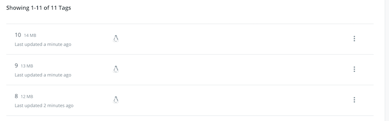

# plain-size-test
Play around with layer and image size

## ECR
To create an image and push it to ECR one needs to create a repository first.

```
$ aws ecr create-repository --repository-name kniec/plain-size-test --region eu-west-1
{
    "repository": {
        "registryId": "xxxxxxx",
        "repositoryName": "kniec/plain-size-test",
        "repositoryArn": "arn:aws:ecr:eu-west-1:xxxxxxx:repository/kniec/plain-size-test",
        "createdAt": 1564382782.0,
        "repositoryUri": "xxxxxxx.dkr.ecr.eu-west-1.amazonaws.com/kniec/plain-size-test"
    }
}
```

## Build
Export the returned URI base so that the image can be build.

```
$ export OCI_REG=xxxxxxx.dkr.ecr.eu-west-1.amazonaws.com
$ ./build.sh
$ unset OCI_REG
```

### Inspect

As the files are sourced from `/dev/zero` they are super-easy to compress, thus they end up using only a couple of MB.

```
docker image ls|awk '/plain-size-test/'
xxxxxxx.dkr.ecr.eu-west-1.amazonaws.com/kniec/plain-size-test    10     11.3GB
xxxxxxx.dkr.ecr.eu-west-1.amazonaws.com/kniec/plain-size-test    9      10.2GB
xxxxxxx.dkr.ecr.eu-west-1.amazonaws.com/kniec/plain-size-test    8      9.22GB
xxxxxxx.dkr.ecr.eu-west-1.amazonaws.com/kniec/plain-size-test    7      8.2GB
xxxxxxx.dkr.ecr.eu-west-1.amazonaws.com/kniec/plain-size-test    6      7.17GB
xxxxxxx.dkr.ecr.eu-west-1.amazonaws.com/kniec/plain-size-test    5      6.15GB
xxxxxxx.dkr.ecr.eu-west-1.amazonaws.com/kniec/plain-size-test    4      5.13GB
xxxxxxx.dkr.ecr.eu-west-1.amazonaws.com/kniec/plain-size-test    3      4.1GB
xxxxxxx.dkr.ecr.eu-west-1.amazonaws.com/kniec/plain-size-test    2      3.08GB
xxxxxxx.dkr.ecr.eu-west-1.amazonaws.com/kniec/plain-size-test    1      2.05GB
xxxxxxx.dkr.ecr.eu-west-1.amazonaws.com/kniec/plain-size-test    0      1.03GB
```

The real sizes are much smaller.

